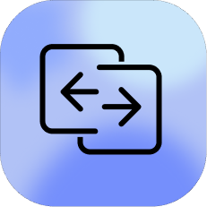

<div>
  
  <br clear="both"/>
</div>

# ClipSync Self-Hosted Fork

This repository is a self-hosted fork of [WinShell-Bhanu/Clipsync](https://github.com/WinShell-Bhanu/Clipsync), forked on March 10, 2026.

It keeps the Android and macOS clipboard-sharing flow, but replaces the hosted Firebase backend with a server you run yourself. The apps now pair against your own server URL and shared API key and are intended to never touch the original hosted service.

---

## Features

- Self-hosted backend with a shared API key
- Android and macOS clients pair against your own server
- Clipboard sync in both directions
- OTP relay from Android to macOS
- End-to-end encrypted clipboard and OTP payloads
- Persistent server state stored locally on your infrastructure

---

## Repository Layout

- `android/`
  Android app
- `mac/`
  macOS app
- `server/`
  Self-hosted Node.js server
- `docker-compose.yml`
  Container deployment for the server

## Self-Hosted Server

The server lives in `server/README.md`. For a Docker deployment:

```bash
cp .env.example .env
```

Edit `.env` and set a long random `CLIPSYNC_SERVER_KEY`, then start:

```bash
docker compose up --build -d
```

The server will listen on port `8787` by default. Point both apps at your host address, for example `http://192.168.1.50:8787`, and use the same API key from `.env`.

## Before You Push

- Keep `.env` local only. It is ignored by Git and should never be committed.
- Keep `server/data/store.json` private. It contains runtime pairings and the persisted server key.
- If you tested locally with real device names or pairings, do not force-add anything under `server/data/`.
- Use your public host or LAN IP in the apps, not `localhost`, unless the client is running on the same machine as the server.

## Build Clients

### Android

Open `android/` in Android Studio and build the `app` target.

CLI build:

```bash
cd android
./gradlew assembleDebug
```

### macOS

Open `mac/ClipSync.xcodeproj` in Xcode, select the `ClipSync` scheme, set your signing team if needed, then build and run.

## First Run

1. Start your self-hosted server.
2. Launch the macOS app and enter the server URL and API key.
3. Launch the Android app and enter the same server URL and API key.
4. Scan the QR code shown on macOS from Android to pair the devices.

## Notes

- Use a server URL reachable by both devices. `localhost` only works when the client and server are on the same machine.
- The project is MIT licensed, matching the upstream repository.
- The checked-in `Secrets.swift` and `Secrets.kt` values are fallback encryption constants for app bootstrapping, not deployment credentials.

---

## License

Distributed under the **MIT License**. See `LICENSE` for more information.
